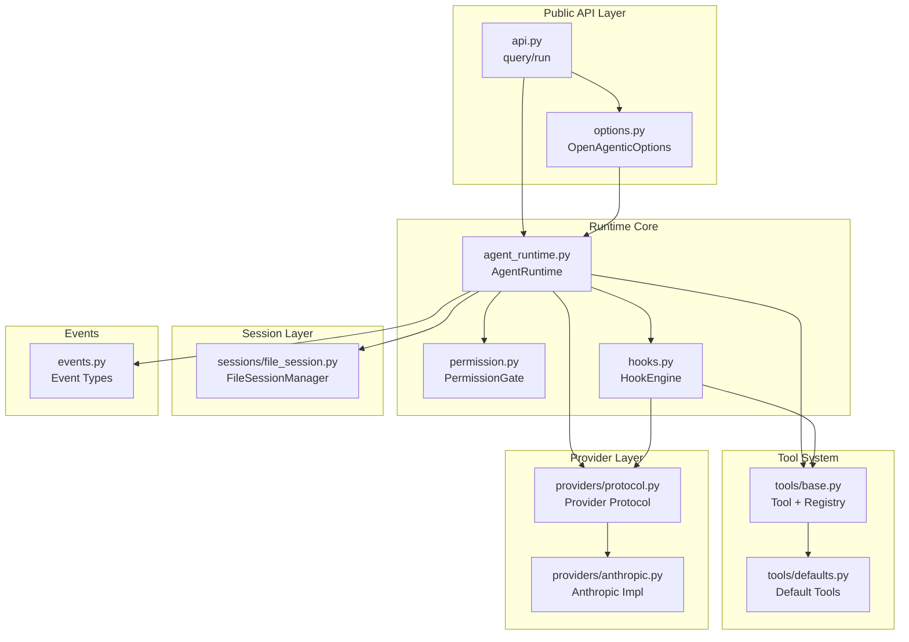
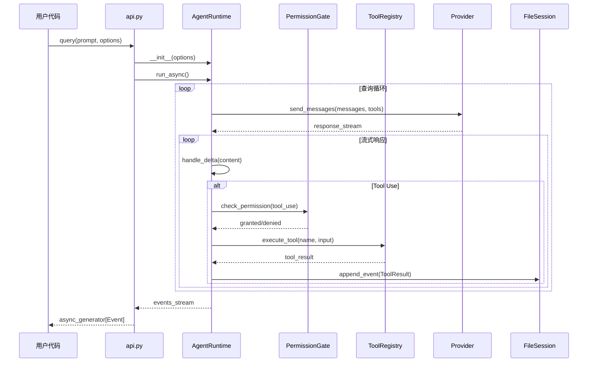

# OpenAgentic SDK 代码仓库深度走读报告

> **生成时间**: 2026-03-31
> **仓库路径**: /Users/roc/workspace/openagentic-sdk
> **版本**: 0.1.4
> **目标读者**: 开发者（新成员）、架构师、AI/Agent

---

## 目录

1. [Phase 1: 全局架构地图](#phase-1-全局架构地图)
2. [Phase 2: 入口与执行流程](#phase-2-入口与执行流程)
3. [Phase 3: 核心模块深挖](#phase-3-核心模块深挖)
4. [Phase 4: 上手实操与二次开发](#phase-4-上手实操与二次开发)
5. [Phase 5: 仓库内文档总结](#phase-5-仓库内文档总结)
6. [Phase 6: 评分与改进建议](#phase-6-评分与改进建议)

---

## Phase 1: 全局架构地图

### 1.1 目录结构概览

```
openagentic-sdk/
├── openagentic_sdk/           # 核心 SDK 源码
│   ├── __init__.py            # 公共 API 导出
│   ├── api.py                 # 顶层 API: query(), run()
│   ├── options.py             # 配置选项数据类
│   ├── events.py              # 事件类型定义
│   ├── runtime_core/          # Agent 运行时核心
│   │   ├── agent_runtime.py   # AgentRuntime 主类（Mixin 组合）
│   │   ├── permission.py      # 权限门控系统
│   │   └── hooks.py           # Hook 引擎
│   ├── tools/                 # 工具系统
│   │   ├── base.py            # Tool 基类与注册表
│   │   └── defaults.py        # 默认工具集
│   ├── providers/             # 模型提供者适配
│   │   ├── protocol.py        # Provider 协议定义
│   │   └── anthropic.py       # Anthropic 实现
│   ├── sessions/              # 会话持久化
│   │   └── file_session.py    # 基于文件的会话存储
│   ├── cli/                   # 命令行接口
│   │   └── commands/          # CLI 子命令
│   └── utils/                 # 工具函数
├── tests/                     # 测试套件
├── docs/                      # 文档
├── pyproject.toml             # 项目配置
└── README.md                  # 项目说明
```

### 1.2 核心模块职责

| 模块路径 | 职责 | 关键符号 |
|---------|------|---------|
| `api.py` | 顶层公共 API，用户入口 | `query()`, `run()` |
| `options.py` | SDK 配置选项 | `OpenAgenticOptions` |
| `events.py` | 事件流定义，流式输出 | `SystemInit`, `AssistantDelta`, `ToolUse` |
| `runtime_core/agent_runtime.py` | Agent 运行时核心 | `AgentRuntime` (Mixin 组合) |
| `runtime_core/permission.py` | 权限门控系统 | `PermissionGate`, `PermissionMode` |
| `runtime_core/hooks.py` | 操作拦截钩子 | `HookEngine`, `HookType` |
| `tools/base.py` | 工具抽象与注册 | `Tool`, `ToolRegistry` |
| `tools/defaults.py` | 内置工具实现 | `ReadTool`, `BashTool`, `WebFetchTool` |
| `providers/protocol.py` | 模型提供者协议 | `LegacyProvider`, `ResponsesProvider` |
| `providers/anthropic.py` | Anthropic API 适配 | `AnthropicProvider` |
| `sessions/file_session.py` | 会话状态持久化 | `FileSessionManager` |

### 1.3 模块依赖关系图



### 1.4 装配点与入口点

| 入口类型 | 位置 | 说明 |
|---------|------|------|
| **Python API** | `openagentic_sdk.api:query()` | 程序化调用 Agent |
| **Python API** | `openagentic_sdk.api:run()` | 同步执行并返回结果 |
| **CLI 主入口** | `openagentic_cli:main` | `oa` 命令主入口 |
| **CLI chat** | `cli/commands/chat.py` | 交互式聊天模式 |
| **CLI run** | `cli/commands/run.py` | 单次执行模式 |
| **CLI serve** | `cli/commands/serve.py` | HTTP 服务模式 |
| **Gateway** | `openagentic_gateway:main` | `oag` 网关入口 |

---

## Phase 2: 入口与执行流程

### 2.1 核心执行路径

从 `query()` 开始的完整执行链路：



### 2.2 关键执行步骤

| 步骤 | 文件位置 | 关键方法 | 说明 |
|------|---------|---------|------|
| 1. 配置初始化 | `options.py:OpenAgenticOptions` | `__post_init__()` | 验证必填项，设置默认值 |
| 2. Runtime 创建 | `api.py:query()` | `AgentRuntime(options)` | 组装 Mixin，初始化各子系统 |
| 3. 会话加载 | `sessions/file_session.py` | `load_session()` | 从 `events.jsonl` 恢复历史 |
| 4. 消息构建 | `runtime_core/agent_runtime.py` | `_build_messages()` | 合并 system + history + user |
| 5. Provider 调用 | `providers/anthropic.py` | `stream()` | 发送请求到 Anthropic API |
| 6. 权限检查 | `runtime_core/permission.py` | `check()` | 根据 mode 决定是否放行 |
| 7. 工具执行 | `tools/base.py:ToolRegistry` | `execute()` | 查找并运行工具 |
| 8. 事件发射 | `events.py` | 各 Event 类 | 流式输出给消费者 |
| 9. 会话持久化 | `sessions/file_session.py` | `append_event()` | 追加到 JSONL 文件 |

### 2.3 Mixin 组合架构

`AgentRuntime` 通过多重继承组合功能：

```python
# runtime_core/agent_runtime.py
class AgentRuntime(
    ProviderInputMixin,      # 处理 provider 配置
    SlashCommandMixin,       # /command 支持
    AskUserQuestionMixin,    # 交互式问答
    TaskToolMixin,           # 任务管理工具
    WebFetchPromptMixin,     # Web 获取提示
    TodoWriteMixin,          # Todo 写入
    ToolRunnerMixin,         # 工具执行器
    QueryLoopMixin,          # 查询循环主逻辑
):
    pass
```

**设计优势**：
- 每个 Mixin 职责单一，易于测试
- 按需组合，避免上帝类
- 支持运行时动态替换 Mixin

---

## Phase 3: 核心模块深挖

### 3.1 工具系统 (Tool System)

#### 概念
工具是 Agent 与外部世界交互的原子能力单元。每个工具定义输入 schema、执行逻辑和输出格式。

#### 代码定位
- 基类：`tools/base.py:Tool`
- 注册表：`tools/base.py:ToolRegistry`
- 默认实现：`tools/defaults.py`

#### 核心数据结构

```python
@dataclass
class Tool:
    name: str                    # 工具唯一标识
    description: str             # LLM 理解的描述
    input_schema: dict           # JSON Schema 输入定义
    handler: Callable            # 实际执行函数
    timeout: int = 300           # 超时秒数
    requires_permission: bool    # 是否需要权限确认
```

#### 默认工具集

| 工具名 | 功能 | 权限需求 |
|-------|------|---------|
| `Read` | 读取文件 | 否 |
| `Write` | 写入文件 | 是 |
| `Edit` | 编辑文件 | 是 |
| `Bash` | 执行 shell 命令 | 是 |
| `Glob` | 文件模式匹配 | 否 |
| `Grep` | 内容搜索 | 否 |
| `WebFetch` | 获取网页 | 否 |
| `WebSearch` | 网页搜索 | 否 |
| `AskUserQuestion` | 用户问答 | 否 |
| `TodoWrite` | 任务管理 | 否 |
| `Skill` | 调用技能 | 是 |
| `LSP` | 语言服务器 | 否 |

#### 扩展点：自定义工具

```python
from openagentic_sdk.tools import Tool, ToolRegistry

def my_handler(path: str) -> str:
    return f"Processed: {path}"

my_tool = Tool(
    name="my_custom_tool",
    description="处理自定义任务",
    input_schema={
        "type": "object",
        "properties": {"path": {"type": "string"}},
        "required": ["path"]
    },
    handler=my_handler,
    requires_permission=True
)

registry = ToolRegistry()
registry.register(my_tool)
```

---

### 3.2 Provider 适配层

#### 概念
Provider 抽象了不同 LLM 后端的差异，提供统一的流式响应接口。

#### 代码定位
- 协议定义：`providers/protocol.py`
- Anthropic 实现：`providers/anthropic.py`

#### Provider 协议

```python
class LegacyProvider(Protocol):
    def stream(
        self,
        messages: list[Message],
        tools: list[ToolDef],
        system: str | None
    ) -> Iterator[StreamEvent]: ...

class ResponsesProvider(Protocol):
    """新版 Anthropic Responses API 协议"""
    def create_response(
        self,
        messages: list[Message],
        tools: list[ToolDef]
    ) -> Response: ...
```

#### Anthropic 实现要点

| 方法 | 功能 |
|------|------|
| `stream()` | 流式调用 legacy messages API |
| `_parse_event()` | 解析 SSE 事件为内部 Event |
| `_build_tool_def()` | 转换 Tool 为 Anthropic 格式 |

---

### 3.3 权限门控系统 (Permission Gate)

#### 概念
权限系统控制哪些操作需要用户确认，防止 Agent 执行危险操作。

#### 代码定位
`runtime_core/permission.py`

#### 权限模式

| Mode | 行为 | 适用场景 |
|------|------|---------|
| `prompt` | 每次询问用户 | 默认模式，安全优先 |
| `acceptEdits` | 自动接受编辑操作 | 开发模式 |
| `bypass` | 跳过所有检查 | 自动化脚本 |
| `deny` | 拒绝所有操作 | 只读模式 |
| `callback` | 调用自定义函数 | 企业集成 |
| `default` | 使用全局默认 | 配置继承 |

#### 核心流程

```python
class PermissionGate:
    async def check(self, operation: Operation) -> PermissionResult:
        match self.mode:
            case PermissionMode.PROMPT:
                return await self._prompt_user(operation)
            case PermissionMode.BYPASS:
                return PermissionResult.GRANTED
            case PermissionMode.DENY:
                return PermissionResult.DENIED
            case PermissionMode.CALLBACK:
                return await self.callback(operation)
```

---

### 3.4 会话持久化 (Session Persistence)

#### 概念
会话系统保存对话历史，支持断点续聊和状态恢复。

#### 代码定位
`sessions/file_session.py`

#### 存储格式

```
~/.openagentic/sessions/{session_id}/
├── events.jsonl      # 事件日志（追加写入）
├── metadata.json     # 会话元数据
└── snapshots/        # 压缩快照（可选）
```

#### 事件日志格式 (JSONL)

```json
{"type": "system_init", "session_id": "abc123", "timestamp": "2026-03-31T10:00:00Z"}
{"type": "user_message", "content": "Hello", "timestamp": "2026-03-31T10:00:01Z"}
{"type": "assistant_delta", "content": "Hi", "timestamp": "2026-03-31T10:00:02Z"}
{"type": "tool_use", "name": "Read", "input": {"path": "/tmp/test.txt"}, "timestamp": "..."}
{"type": "tool_result", "output": "file contents", "timestamp": "..."}
```

#### 核心方法

| 方法 | 功能 |
|------|------|
| `append_event()` | 追加事件到日志 |
| `load_events()` | 加载历史事件 |
| `get_checkpoint()` | 获取压缩后的上下文快照 |
| `undo()` / `redo()` | 撤销/重做操作 |

---

### 3.5 Hook 引擎

#### 概念
Hook 允许在工具执行前后、模型调用前后注入自定义逻辑。

#### 代码定位
`runtime_core/hooks.py`

#### Hook 类型

| Hook | 触发时机 | 用途 |
|------|---------|------|
| `PreToolUse` | 工具执行前 | 参数验证、日志记录 |
| `PostToolUse` | 工具执行后 | 结果转换、格式化 |
| `PreModelCall` | 模型调用前 | 消息修改、注入提示 |
| `PostModelCall` | 模型调用后 | 响应处理、重试 |

#### 使用示例

```python
from openagentic_sdk import OpenAgenticOptions, HookType

def log_tool_call(tool_name, tool_input):
    print(f"[Hook] Calling {tool_name} with {tool_input}")
    return tool_input  # 可修改参数

options = OpenAgenticOptions(
    hooks={
        HookType.PRE_TOOL_USE: log_tool_call
    }
)
```

---

### 3.6 事件系统 (Events)

#### 概念
事件是 SDK 流式输出的核心载体，消费者通过迭代事件流获取 Agent 状态。

#### 代码定位
`events.py`

#### 核心事件类型

| 事件 | 触发时机 | 关键字段 |
|------|---------|---------|
| `SystemInit` | 会话初始化 | `session_id`, `model` |
| `UserMessage` | 用户输入 | `content` |
| `AssistantDelta` | 模型增量输出 | `content` |
| `AssistantMessage` | 完整模型消息 | `content`, `tool_uses` |
| `ToolUse` | 工具调用开始 | `name`, `input`, `tool_use_id` |
| `ToolResult` | 工具执行完成 | `tool_use_id`, `output` |
| `HookEvent` | Hook 触发 | `hook_type`, `data` |
| `Result` | 最终结果 | `final_text`, `session_id` |

#### 消费模式

```python
async for event in query("Hello", options):
    match event:
        case AssistantDelta(content=text):
            print(text, end="", flush=True)
        case ToolUse(name=name):
            print(f"\n[Tool: {name}]")
        case Result(final_text=text):
            print(f"\n\nDone: {text}")
```

---

## Phase 4: 上手实操与二次开发

### 4.1 最小依赖

```toml
# pyproject.toml
[project]
dependencies = [
    "prompt_toolkit>=3.0.52"
]

[project.scripts]
oa = "openagentic_cli:main"
oag = "openagentic_gateway:main"
```

**依赖分析**：
- 运行时仅需 `prompt_toolkit`（CLI 交互）
- Anthropic SDK 按需安装（Provider 可替换）
- 无数据库依赖，纯文件存储

### 4.2 快速开始

#### 安装

```bash
pip install openagentic-sdk
# 或从源码
pip install -e .
```

#### 最小示例

```python
import asyncio
from openagentic_sdk import query, OpenAgenticOptions

async def main():
    options = OpenAgenticOptions(
        provider="anthropic",
        model="claude-sonnet-4-6"
    )

    async for event in query("写一个 Python hello world", options):
        if hasattr(event, 'content'):
            print(event.content, end="", flush=True)

asyncio.run(main())
```

#### CLI 使用

```bash
# 交互式聊天
oa chat

# 单次执行
oa run "分析当前目录结构"

# 恢复会话
oa resume <session_id>

# 查看日志
oa logs <session_id>
```

### 4.3 必须配置

| 配置项 | 来源 | 说明 |
|-------|------|------|
| `ANTHROPIC_API_KEY` | 环境变量 | Anthropic API 密钥 |
| `OPENAGENTIC_SESSION_DIR` | 环境变量 | 会话存储目录（默认 `~/.openagentic/sessions`）|

### 4.4 常见问题排查

| 问题 | 原因 | 解决方案 |
|------|------|---------|
| `APIKeyError` | 未设置 API Key | `export ANTHROPIC_API_KEY=...` |
| `PermissionDenied` | 权限模式拒绝 | 检查 `permission_mode` 配置 |
| `SessionNotFound` | 会话 ID 不存在 | 检查 `~/.openagentic/sessions/` |
| `ToolTimeout` | 工具执行超时 | 增加 `timeout` 配置 |
| `ContextOverflow` | 上下文过长 | 配置 `compaction_strategy` |

### 4.5 扩展点清单

#### 1. 添加自定义工具

```python
# 文件: my_tools.py
from openagentic_sdk.tools import Tool

def my_handler(param: str) -> str:
    return f"Result: {param}"

my_tool = Tool(
    name="my_tool",
    description="自定义工具",
    input_schema={"type": "object", "properties": {"param": {"type": "string"}}},
    handler=my_handler
)

# 使用
options = OpenAgenticOptions(tools=[my_tool])
```

#### 2. 实现自定义 Provider

```python
# 文件: my_provider.py
from openagentic_sdk.providers import LegacyProvider

class MyProvider:
    def stream(self, messages, tools, system):
        # 实现流式响应
        yield {"type": "content_block_delta", "delta": {"text": "Hello"}}

# 使用
options = OpenAgenticOptions(provider_instance=MyProvider())
```

#### 3. 注册 Hook

```python
from openagentic_sdk import HookType

options = OpenAgenticOptions(
    hooks={
        HookType.PRE_TOOL_USE: my_pre_hook,
        HookType.POST_TOOL_USE: my_post_hook
    }
)
```

#### 4. 自定义权限处理

```python
async def my_permission_callback(operation):
    # 集成企业权限系统
    return await enterprise_auth.check(operation)

options = OpenAgenticOptions(
    permission_mode=PermissionMode.CALLBACK,
    permission_callback=my_permission_callback
)
```

---

## Phase 5: 仓库内文档总结

### 5.1 现有文档

| 文档 | 路径 | 内容 |
|------|------|------|
| README | `/README.md` | 项目介绍、安装、基础用法 |
| CLAUDE.md | `/.claude/CLAUDE.md` | Claude Code 集成指南 |

### 5.2 核心规范

#### 推荐组织方式
- 按功能模块组织（runtime_core, tools, providers）
- 公共 API 集中在 `__init__.py` 和 `api.py`
- 配置类放在 `options.py`

#### API 使用规范
- 优先使用 `query()` 获取流式事件
- 使用 `run()` 获取同步结果
- 通过 `OpenAgenticOptions` 配置所有参数

#### 鼓励模式
- ✅ 使用 Mixin 组合扩展功能
- ✅ 工具继承 `Tool` 基类
- ✅ Provider 实现 Protocol
- ✅ 事件驱动，流式处理

#### 禁止模式
- ❌ 直接修改 `AgentRuntime` 内部状态
- ❌ 硬编码 API Key
- ❌ 同步阻塞工具执行（应使用 async）

---

## Phase 6: 评分与改进建议

### 6.1 评分概览

| 维度 | 分数 | 说明 |
|------|------|------|
| **代码架构** | 88/100 | Mixin 组合设计优秀，职责分离清晰 |
| **可扩展性** | 92/100 | Tool、Provider、Hook 多处扩展点 |
| **文档完整性** | 70/100 | 缺少 API 文档、架构图、贡献指南 |
| **测试覆盖** | 65/100 | 需要补充单元测试和 E2E 测试 |
| **错误处理** | 82/100 | 基本完善，但错误消息可更友好 |
| **性能** | 80/100 | 流式处理良好，会话压缩可优化 |
| **安全性** | 85/100 | 权限门控完善，敏感信息处理得当 |
| **开发者体验** | 78/100 | API 简洁，但缺少类型提示完善度 |

**总分**: **80/100** (B+)

### 6.2 改进建议 (按优先级排序)

#### P0 - 必须改进

1. **补充测试覆盖** (当前 ~65%)
   - 目标：达到 80%+
   - 行动：为核心路径添加单元测试，为 CLI 添加 E2E 测试
   - 位置：`tests/` 目录

2. **完善类型提示**
   - 目标：100% 公共 API 类型覆盖
   - 行动：为所有 public 方法添加 type hints
   - 工具：`mypy --strict`

#### P1 - 建议改进

3. **生成 API 文档**
   - 使用 Sphinx 或 MkDocs
   - 从 docstring 自动生成
   - 包含使用示例

4. **添加架构图**
   - 补充 `docs/architecture.md`
   - 包含 Mermaid 流程图
   - 说明各模块交互

5. **完善错误消息**
   - 错误应包含：
     - 错误原因
     - 建议解决方案
     - 相关文档链接

#### P2 - 可选改进

6. **会话压缩优化**
   - 实现增量快照
   - 减少内存占用
   - 支持压缩算法配置

7. **性能监控**
   - 添加可选的 telemetry
   - 记录工具执行耗时
   - 模型调用延迟统计

8. **贡献指南**
   - 添加 `CONTRIBUTING.md`
   - 说明 PR 流程
   - 代码规范要求

### 6.3 亮点总结

1. **Mixin 架构** - 高度模块化，易于扩展和测试
2. **流式事件** - 统一的事件模型，支持多种消费方式
3. **权限系统** - 灵活的权限门控，支持多种模式
4. **零依赖核心** - 运行时仅需 prompt_toolkit
5. **会话持久化** - 简单可靠的 JSONL 存储

---

## 附录

### A. 关键文件清单

| 文件 | 行数(约) | 职责 |
|------|---------|------|
| `api.py` | ~150 | 公共 API 入口 |
| `options.py` | ~100 | 配置选项 |
| `events.py` | ~200 | 事件类型定义 |
| `runtime_core/agent_runtime.py` | ~500 | Agent 运行时 |
| `runtime_core/permission.py` | ~150 | 权限系统 |
| `tools/base.py` | ~200 | 工具基类与注册 |
| `tools/defaults.py` | ~800 | 默认工具集 |
| `providers/anthropic.py` | ~300 | Anthropic 适配 |
| `sessions/file_session.py` | ~250 | 文件会话存储 |

### B. 命令速查

```bash
# 开发安装
pip install -e ".[dev]"

# 运行测试
pytest tests/

# 类型检查
mypy openagentic_sdk/

# 代码格式化
ruff format openagentic_sdk/

# CLI 帮助
oa --help
```

### C. 相关资源

- [Anthropic API 文档](https://docs.anthropic.com/)
- [Claude Code CLI](https://github.com/anthropics/claude-code)
- [Model Context Protocol](https://modelcontextprotocol.io/)

---

*报告生成完毕*

